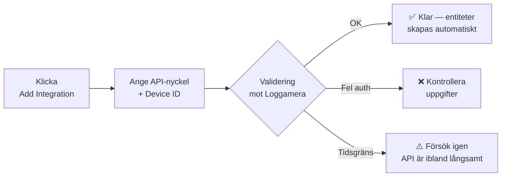

# Comfortzone Heat Pump

**Smart Home Assistant-integration för Comfortzone frånluftsvärmepumpar via Loggamera-API:t.**  
*(English documentation below)*

[![HACS][hacs-badge]][hacs-url]
[![Version][version-badge]][release-url]
[![License][license-badge]][license-url]
[![Home Assistant][ha-badge]][ha-url]

[Installera](#-installation) · [Konfiguration](#%EF%B8%8F-konfiguration) · [Entiteter](#-entiteter) · [Felsökning](#-felsökning) | [English](#-english-documentation)

---

## ✨ Funktioner

| | |
| :-- | :-- |
| 🌡️ **Klimatentitet** | Styr inomhustemperatur, läs av kompressor och ventiltillstånd. |
| 🚿 **Varmvatten** | Justera börvärde, aktivera extra varmvatten, övervaka temperatur. |
| 📊 **24+ sensorer** | Inomhus, ute, frånluft, kompressor­effekt, frekvens, fläkthastighet, tillsats m.m. |
| 🚨 **Larm & status** | Filterlarm, huvudlarm, kompressor­status, ventil­läge — allt som binär­sensorer. |
| 🎚️ **Värmekurva** | Justera värmekurva och semester­dagar direkt från dashboarden. |
| 🛡️ **Smart kö** | Inbyggd kö och retry hanterar långsam Loggamera-API utan att krascha integrationen. |
| 🇸🇪 **Svensk översättning** | Hela konfigurations­flödet på svenska. |
| 🩺 **Diagnostik** | Inbyggd "Download Diagnostics" med dold API-nyckel — perfekt för bug-rapporter. |

---

## 🚀 Installation

### Steg 1 — Lägg till repot i HACS (one-click)

> 💡 **Klicka på knappen ovan** för att öppna HACS direkt i din Home Assistant och förhandsgranska repot. Klicka därefter på **DOWNLOAD**.

📖 Manuell HACS-installation (om knappen inte fungerar)

1. Öppna **HACS** i Home Assistant.
2. Klicka på **⋮** (tre prickar) uppe till höger → **Custom repositories**.
3. Klistra in `https://github.com/tengmo-ab/comfortzone` och välj kategori **Integration**.
4. Klicka på **ADD**, sök sedan upp *Comfortzone Heat Pump* i listan och tryck **DOWNLOAD**.
5. **Starta om Home Assistant.**

🛠️ Manuell installation utan HACS

1. Ladda ner senaste releasen från [Releases][release-url].
2. Kopiera mappen `custom_components/comfortzone/` till `<config>/custom_components/comfortzone/` på din HA-instans.
3. Starta om Home Assistant.

### Steg 2 — Lägg till integrationen

> 💡 **Klicka på knappen** för att hoppa direkt till "Add Integration"-dialogen i Home Assistant.

Eller lägg till den manuellt: **Inställningar → Enheter & tjänster → + Lägg till integration → Comfortzone Heat Pump**.

---

## ⚙️ Konfiguration

Du behöver två uppgifter från [Loggamera-portalen](https://portal.loggamera.se/):

| Fält | Var hittar jag det? |
| :-- | :-- |
| **API-nyckel** | Gå till **Inställningar - API** i Loggamera-portalen ([portal.loggamera.se/ApiSettings/Index/](https://portal.loggamera.se/ApiSettings/Index/)) och generera eller kopiera din nyckel. |
| **Enhets-ID** | Hittas på samma sida under **Inställningar - API** (det är ett numeriskt ID, t.ex. `12345`). |
| **Modell** | Välj `RX95` (eller `Other` om du har en annan modell). Detta kan ändras i efterhand. |

---

## 📊 Entiteter

<b>Klimat & varmvatten</b>

| Entitet | Typ | Beskrivning |
| :-- | :-- | :-- |
| `climate.comfortzone_climate` | Climate | Inomhus­temperatur, HEAT/OFF, HVAC-action |
| `number.comfortzone_hot_water_temp_setpoint` | Number | Börvärde varmvatten (30–60°C) |
| `number.comfortzone_heat_curve` | Number | Värmekurva (0,0–6,0) |
| `number.comfortzone_holiday_reduction_days` | Number | Semesterdagar (0–9) |
| `switch.comfortzone_hot_water_extra` | Switch | Extra varmvatten |
| `button.comfortzone_acknowledge_alarm` | Button | Kvittera huvudlarm |
| `button.comfortzone_reset_filter_alarm` | Button | Återställ filterlarm |

<b>Temperatur­sensorer</b>

`indoor_temp`, `outdoor_temp`, `hot_water_temp`, `heat_carrier_in`, `heat_carrier_out`, `exhaust_air_temp`, `set_indoor_temp`, `target_hw_temp`, `heater_element_allowed`

<b>Effekt, frekvens, fläkt</b>

`compressor_power`, `addition_power`, `total_output_power`, `compressor_freq`, `compressor_freq_max`, `circulation_pump_speed`, `fan_speed_current`

<b>Larm & ventiler (binary sensors)</b>

`filter_alarm`, `main_alarm`, `compressor_active`, `room_thermostat`, `heating_valve`, `hot_water_valve`, `cooling_installed`, `cooling_enabled`, `dual_heating_curves`

<b>Smarta beräknade sensorer ⭐ (utbyggd i 2.2)</b>

| Entitet | Beskrivning |
| :-- | :-- |
| `sensor.comfortzone_pump_activity_status` | `Heating` / `Making Hot Water` / `Idle` / `Defrosting` |
| `sensor.comfortzone_estimated_total_power` | Estimerad **total el-förbrukning** (W) |
| `sensor.comfortzone_estimated_aux_power` | Aux (fläkt + standby) – av som standard |
| `sensor.comfortzone_heating_power` | El bara vid värmedrift (W) |
| `sensor.comfortzone_hot_water_power` | El bara vid varmvattenproduktion (W) |
| `sensor.comfortzone_heating_energy` | Kumulativ kWh värme (Energi-panel) |
| `sensor.comfortzone_hot_water_energy` | Kumulativ kWh varmvatten (Energi-panel) |
| `sensor.comfortzone_total_energy` | Kumulativ kWh totalt |
| `sensor.comfortzone_addition_heater_energy` | Kumulativ kWh tillskott (Energi-panel) |
| `sensor.comfortzone_heating_cost` | Kumulativ kostnad värme (kräver prissensor) |
| `sensor.comfortzone_hot_water_cost` | Kumulativ kostnad varmvatten |
| `sensor.comfortzone_instant_cop` | Momentan COP — visas vid kompressordrift > 100 W |
| `sensor.comfortzone_compressor_cycle_count` | Antal kompressorstarter sen install (slitageindikator) |
| `sensor.comfortzone_defrost_cycle_count` | Antal detekterade avfrostningar |
| `sensor.comfortzone_last_defrost_duration` | Längd på senaste avfrostning (min) |
| `sensor.comfortzone_heating_runtime` | Total drifttid värmeläge (h) |
| `sensor.comfortzone_hot_water_runtime` | Total drifttid VV-läge (h) |
| `sensor.comfortzone_heating_circuit_delta_t` | Flow − Return på värmesidan (°C). Uppdateras **bara under värmedrift**; håller senaste värdet annars. Hälsosamt: 3–7°C |
| `sensor.comfortzone_hot_water_loop_delta_t` | Absolut Δ över värmeväxlaren under VV-produktion (°C). Hälsosamt: ~25–40°C |
| `binary_sensor.comfortzone_compressor_short_cycling` | Larm — kompressorn startar >6 gånger på 1h |
| `binary_sensor.comfortzone_addition_heater_active` | Larm — tillskott (elpatron) >500W i mer än 10 min |
| `binary_sensor.comfortzone_filter_change_due_soon` | Förvarning — <7 dagar kvar till filterbyte |
| `binary_sensor.comfortzone_low_hot_water` | Larm — VV-tank under tröskel (default 40°C, hysteres 3°C; båda konfigurerbara) |
| `sensor.comfortzone_addition_heater_runtime` | Total drifttid tillskott (h) — räknar samples >100 W |
| `sensor.comfortzone_dhw_production_rate` | Termisk kW under VV-produktion (5-min snitt). Av som standard |
| `sensor.comfortzone_tank_heating_rate` | °C/h under VV-laddning (motsvarighet till tank_decay_rate). Av som standard |
| `sensor.comfortzone_compressor_load_percentage` | Aktuell kompressor-belastning (frekvens / max-frekvens × 100) |
| `binary_sensor.comfortzone_compressor_running_at_max` | Larm — kompressorn har kört nära max (default ≥90% i ≥5 min). Användbar trigger för "pumpen har inget headroom kvar" |
| `sensor.comfortzone_tank_decay_rate` | Hur snabbt VV-tanken tappar °C/h vid idle |
| `sensor.comfortzone_specific_heating_energy` | kWh per °C inomhus-höjning (EMA) |
| `sensor.comfortzone_reduced_fan_weekdays_schedule` | Diagnostik: fläktreduktions­schema veckodagar |
| `sensor.comfortzone_reduced_fan_weekends_schedule` | Diagnostik: fläktreduktions­schema helger |
| `binary_sensor.comfortzone_shower_in_progress` | Heuristisk dusch-detektor (snabb tappning av VV-tanken) |

**Termisk-till-elektrisk konvertering:** Varje modell har sin egen EN255-baserade kurva som interpoleras automatiskt över aktuell flow-temp. För **RX95** används datablads­punkterna 3,4 kW termiskt vid 0,8 kW el (35°C framledning) och 3,5 kW vid 1,1 kW (50°C). Andra modeller (`Other`) faller tillbaka till en generisk faktor (0,30) tills datablads­värden lagts till i `MODEL_COP_CURVES`. För att override:a kurvan helt — sätt `Compressor factor override` i Options.

**Varför smart?** Frånluftsvärmepumpen har **bara en kompressor** → all el går till antingen värme **eller** varmvatten, aldrig båda samtidigt. Vi kan separera el-förbrukningen per syfte och föda Energi-panelen med staplade dygns- och månads­kostnader.

**Tips för Energi-panelen:** Lägg till `comfortzone_heating_energy` och `comfortzone_hot_water_energy` under "Individuella enheter".

---

## ⚙️ Avancerade alternativ

Öppna **Inställningar → Enheter & tjänster → Comfortzone Heat Pump → Konfigurera** för att justera:

| Alternativ | Beskrivning |
| :-- | :-- |
| **Heat pump model** | `RX95` eller `Other` – styr enhetens märke/visning |
| **Electricity price entity** | Entitets-ID för Nord Pool/elpris-sensor. Krävs för kostnadssensorerna. |
| **Price reports öre/kWh** | **Avstängd som default.** Den moderna officiella Nord Pool-integrationen i HA rapporterar redan i lokal valuta (`SEK/kWh` för SE3) — låt switchen vara av. Aktivera bara om din prissensor rapporterar i öre/kWh (gammal mall-baserad uppsättning). |
| **Compressor factor override** | `0` (default) = använd den valda **modellens** EN255 spec-kurva. För `RX95` är kurvan 0,235 vid 35°C → 0,314 vid 50°C framledning (datablad). För `Other` används en generisk fallback (0,30 ≈ COP 3,3). Sätt ett värde t.ex. `0,4` om du vill ange en konstant konservativ faktor. |
| **Short-cycling threshold** | Standard `6` starter/timme. Kortcykling-larmet aktiveras vid eller över. |
| **Addition power threshold** | Standard `500` W. Sample under detta räknas som "av". |
| **Addition duration threshold** | Standard `600` s (10 min). Sammanhängande tid över power-tröskeln innan tillskott-larmet aktiveras. |
| **Filter warning days** | Standard `7` dagar kvar för förvarningen. |
| **Low HW threshold + hysteresis** | Standard `40` °C tröskel + `3` °C hysteres → larm aktiveras < 40 °C, släpper > 43 °C. |
| **Compressor running-at-max threshold + duration** | Standard `90` % i `300` s → trippar när inverter-frekvensen varit ≥ 90 % av max sammanhängande i ≥ 5 minuter. |

---

## 🩺 Felsökning

| Symptom | Trolig orsak | Lösning |
| :-- | :-- | :-- |
| `cannot_connect` vid setup | Loggamera långsamt eller offline | Vänta 1–2 min och försök igen. Integrationen försöker på nytt automatiskt vid drift. |
| `invalid_auth` | Fel API-nyckel/Device-ID | Verifiera båda i Loggamera-portalen under *Inställningar - API*. |
| Entiteter "unavailable" tillfälligt | API rapporterar `busy` | Helt normalt — gammal data behålls och nästa polling fyller på med ny. |
| Vissa sensorer saknar värde | Modellen rapporterar inte fältet | Vissa fält finns bara på specifika modeller (T.ex. `defrost_*`). |

**Ladda diagnostik:** *Inställningar → Enheter & tjänster → Comfortzone Heat Pump → ⋮ → Download diagnostics*. API-nyckel och Device-ID rensas automatiskt för din integritet.

---

  

# 🇬🇧 English Documentation

**Smart Home Assistant integration for Comfortzone exhaust air heat pumps via the Loggamera API.**

## ✨ Features
- **Climate Entity:** Control indoor temperature, read compressor and valve states.
- **Hot Water:** Adjust target temperature, activate extra hot water.
- **30+ Sensors:** Indoor, outdoor, exhaust air, compressor power, frequency, fan speed, etc.
- **Alarms & Status:** Filter alarm, main alarm, compressor status, valve positions (binary sensors).
- **Settings:** Adjust heating curve and holiday days directly from your dashboard.
- **Smart Queuing:** Built-in write queue to handle the slow Loggamera API smoothly without crashing the integration.
- **Diagnostics:** Built-in "Download Diagnostics" with redacted API key for easy bug reporting.
- **Energy panel ready (new in 2.1):** Per-mode kWh sensors split between *space heating* and *domestic hot water*, plus optional cost sensors via a Nord Pool price entity. Because the RX95 has a single compressor, every kWh is unambiguously attributable to one of the two purposes.

## 🚀 Installation

### Step 1 — Add repository to HACS

> 💡 **Click the button above** to open HACS directly in your Home Assistant and preview the repository. Then click **DOWNLOAD**.

If you prefer a manual installation, simply copy the `custom_components/comfortzone/` directory to your `<config>/custom_components/` folder and restart Home Assistant.

### Step 2 — Add the integration

> 💡 **Click the button** to jump straight to the "Add Integration" dialogue in Home Assistant.

Or add it manually: **Settings → Devices & Services → + Add Integration → Comfortzone Heat Pump**.

## ⚙️ Configuration

You will need two pieces of information from the [Loggamera portal](https://portal.loggamera.se/):

| Field | Where to find it |
| :-- | :-- |
| **API key** | Navigate to **Settings - API** in the Loggamera portal ([portal.loggamera.se/ApiSettings/Index/](https://portal.loggamera.se/ApiSettings/Index/)) and generate or copy your key. |
| **Device ID** | Found on the exact same page under **Settings - API** (it is a numeric ID, e.g. `12345`). |
| **Model** | Select `RX95` (or `Other` if you have a different model). This can be changed later. |

## 🩺 Troubleshooting

- **`cannot_connect` during setup:** The Loggamera API might be slow or temporarily offline. Wait a minute and try again.
- **`invalid_auth`:** Double-check your API key and Device ID in the Loggamera portal.
- **Entities temporarily "unavailable":** The API sometimes returns a `busy` status. This is normal and the integration will automatically retry on the next poll cycle.
- **Missing sensor values:** Some models do not report certain data fields (e.g. `defrost_*`).

---

## 🤝 Bidrag / Contributions

PR:s, issue-rapporter och dashboard-exempel är välkomna! Öppna en [issue][issues-url] eller skicka en pull request.  
*PRs and issues are welcome!*

## 📝 Licens / License

[Apache License 2.0][license-url]

---

Inte affilierad med Comfortzone AB eller Loggamera AB.  
*Not affiliated with Comfortzone AB or Loggamera AB.*

[hacs-badge]: https://img.shields.io/badge/HACS-Custom-41BDF5.svg?style=flat-square
[hacs-url]: https://github.com/hacs/integration
[version-badge]: https://img.shields.io/github/v/release/tengmo-ab/comfortzone?style=flat-square
[release-url]: https://github.com/tengmo-ab/comfortzone/releases
[license-badge]: https://img.shields.io/github/license/tengmo-ab/comfortzone?style=flat-square
[license-url]: https://github.com/tengmo-ab/comfortzone/blob/main/LICENSE
[ha-badge]: https://img.shields.io/badge/Home%20Assistant-2024.10%2B-41BDF5.svg?style=flat-square&logo=home-assistant
[ha-url]: https://www.home-assistant.io/
[issues-url]: https://github.com/tengmo-ab/comfortzone/issues
